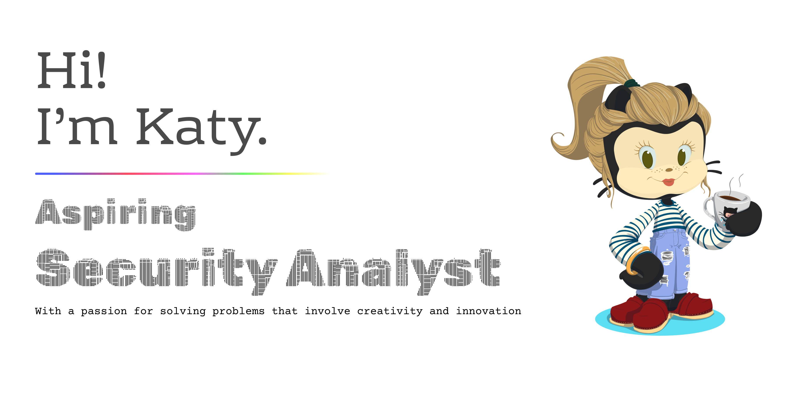

<!-- Current Focus / Learning -->

  🔍 <strong>Learning:</strong> Python • Networking • Active Directory • Cybersecurity Fundamentals • Threat Detection • Vulnerability Scanning 
  🛠️ <strong>Tools & Technologies:</strong> Bash • PowerShell • Linux • Windows • VirtualBox • Wireshark 
  🔧 <strong>Practicing:</strong> User Management • System Hardening • Troubleshooting • Network Configuration

---

<h3 align="center">Core Tech Stack</h3>

   
   
   
   
   
   
   
  <!-- Add any others here -->

--- 

<h3 align="center">Achievements & Certifications</h3>

 
  
  

  

  <a href="https://tryhackme.com/p/katyfa"> <!-- Keep the link -->
    
  </a>

---

<!-- GitHub Stats Section 
<h4 align="center">My GitHub Activity</h4>

  
    <!-- Optional: Add a line break if you want the language card below
  <a href="https://github.com/KatyFrancesA">
    <!-- Consider layout=compact for less space
    
  </a> 

   
   

  
 

---- -->

  
<strong>📃 CV</strong>

  <h2>Education</h2>

  *   **Level 4 Software Development and Testing** - _Distinction_  
      📆 Jan - Mar 2025  
      📍 Gateshead College

*   **Software Development Fundementals Bootcamp** 
      📆 Oct - Feb 2022  
      📍 Firebrand
      
 <h2>Certifications</h2>
   
  *   **Microsoft Security, Compliance and Identity Fundamentals (SC-900)**  
      📆 Apr 2025  

  *   **Microsoft Technology Associate: Software Development Fundamentals (MTA 98-361)**  
      📆 Feb 2022  
      
  *   **PCAP – Certified Associate in Python Programming** 
      📆 Feb 2022  
      
  <h2>💼 Work Experience</h2>

  *   **Customer Service Advisor** 
      📆 Sep 2022 – May 2025  
      📍 G4S  
      *Key Responsibilities:* Resolved complex customer inquiries efficiently; Maintained compliance with data security procedures; Collaborated with team members.

  *   **Customer Service Specialist** 
      📆 Feb 2020 – Jan 2022  
      📍 Student Loans Company  
      *Key Responsibilities:* Investigated and resolved complex account issues; Ensured strict compliance with data handling (GDPR); Communicated technical information clearly.
      

---

<h4 align="center">Reach Me</h4>  

  
  &nbsp;
  

<!---
KatyFrancesA/KatyFrancesA is a ✨ special ✨ repository because its `README.md` (this file) appears on your GitHub profile.
You can click the Preview link to take a look at your changes.
--->
