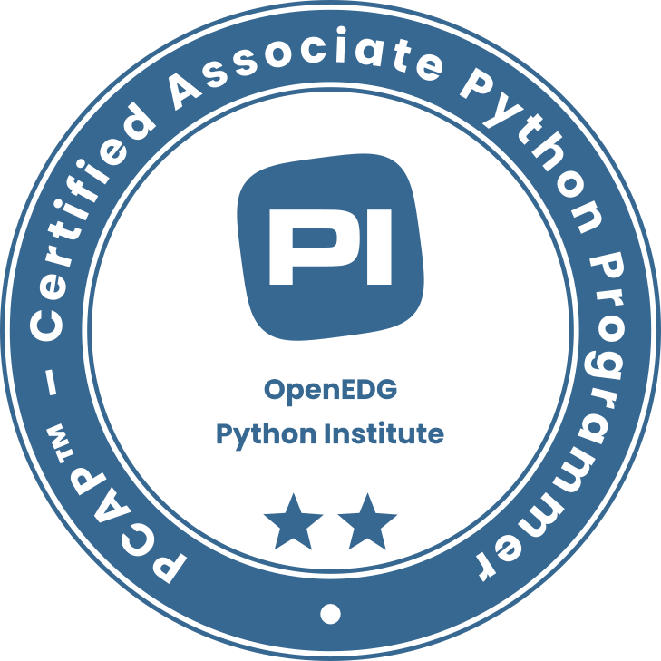

  🔍 <strong>Focus:</strong> Software Quality Assurance • Defect Lifecycle Management • Accessibility (WCAG) Auditing • Business Logic Validation 
  🛠️ <strong>Tools & Technologies:</strong> Chrome DevTools • Postman (API) • SQL • Java • JUnit • Jira 
  🔧 <strong>Practicing:</strong> Exploratory Testing • Boundary Value Analysis • Bug Reporting • UI/UX Integrity

---

<h3 align="center">Core Tech Stack</h3>

   
   
   
   
   
   
   
   

--- 

<h3 align="center">Achievements & Certifications</h3>

 
  
  

  

  

---

  
<strong>📃 CV & Experience</strong>

  <h2>Education & Projects</h2>

  * **Level 4 Software Development and Testing** - _Distinction_  
      📆 Jan - Mar 2025 | 📍 Gateshead College  
      *Project Focus:* Executed structured manual testing against business requirements. Authored comprehensive defect reports and successfully re-architected a banking application to eradicate floating-point calculation errors using BigDecimal.

  * **Software Development Fundamentals Bootcamp** 
      📆 Oct - Feb 2022 | 📍 Firebrand
      
 <h2>Certifications</h2>
   
  * **Microsoft Security, Compliance and Identity Fundamentals (SC-900)** | 📆 Apr 2025  
  * **Microsoft Technology Associate: Software Development Fundamentals (MTA 98-361)** | 📆 Feb 2022  
  * **PCAP – Certified Associate in Python Programming** | 📆 Feb 2022  
      
  <h2>💼 Work Experience</h2>
  
  * **Independent Application QA & E-Commerce Management** 
      📆 Jan 2022 – Present 
      *Key Responsibilities:* Acted as lead QA for an independent AI-assisted application build, executing manual exploratory testing across multiple breakpoints using DevTools. Managed e-commerce operations, strictly enforcing inventory data accuracy and optimizing UI/UX purchasing flows.

  * **Customer Service Advisor (Government Contracts)** 
      📆 Sep 2022 – May 2025 | 📍 G4S   
      *Key Responsibilities:* Navigated complex internal software systems to manage a high volume of requests, identifying edge cases and user-flow friction points. Enforced strict data integrity and regulatory compliance across government accounts.

  * **Customer Advisor** 
      📆 Feb 2020 – Jan 2022 | 📍 Student Loans Company   
      *Key Responsibilities:* Utilized diagnostic questioning to resolve complex inquiries. Maintained strict adherence to GDPR and data confidentiality protocols while handling sensitive financial data.
      

---

<h4 align="center">Reach Me</h4>  

  
  &nbsp;
  

<!---
KatyFrancesA/KatyFrancesA is a ✨ special ✨ repository because its `README.md` (this file) appears on your GitHub profile.
You can click the Preview link to take a look at your changes.
--->
