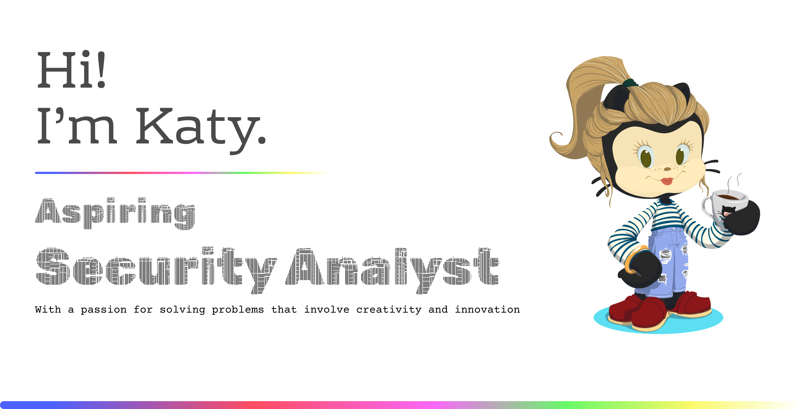

📬 **Reach Me**:
- ✉️ [katyfrances@gmail.com](mailto:katyfrances@gmail.com)  
- 🔗 [About Me Webpage](https://katyfrancesa.github.io/intro/)  
- 💼 [LinkedIn](https://www.linkedin.com/in/katyfrancesa/)
- 👉 [Follow Me](https://github.com/katyfrancesa)
 
  

**Achievements**

 

                              💻 Privacy Advocate | Creative Wanderer   
                            🔍 Learning: Python • Networking • Pentesting   
                            🛠️ Tools: Nmap • Wireshark • Metasploit • Bash  
                 🧠 Passionate about: digital privacy, ethical hacking & problem-solving   
                 🌐 Exploring: Threat Modeling, Packet Analysis, Vulnerability Scanning  

<!---
KatyFrancesA/KatyFrancesA is a ✨ special ✨ repository because its `README.md` (this file) appears on your GitHub profile.
You can click the Preview link to take a look at your changes.
--->
